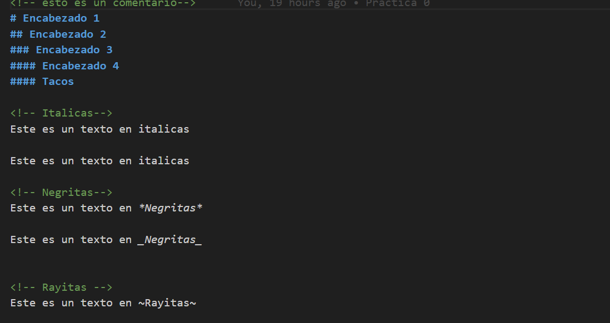
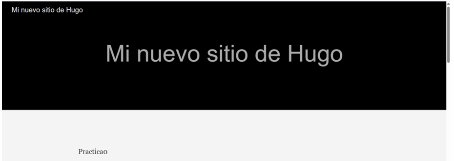
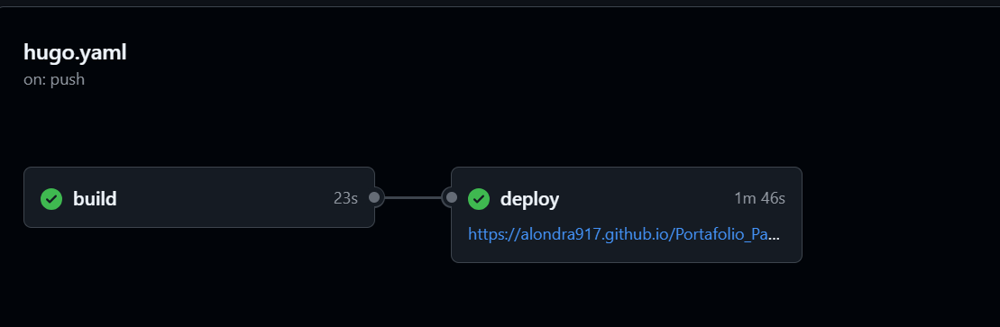

+++
date = '2025-03-11T08:44:00-08:00'
draft = false 
title = 'Práctica #0 Uso de Repositorios'
+++
# *PARADIGMAS DE LA PROGRAMACIÓN*
## Herramientas Fundamentales de Desarrollo de Software
En esta práctica, exploramos el uso de herramientas esenciales para el desarrollo web, como Markdown, Git, Hugo y GitHub. A lo largo de varias sesiones, nos familiarizamos con la creación de contenido estructurado utilizando Markdown, la gestión de versiones y colaboración en proyectos con Git y GitHub, y la generación de páginas estáticas mediante Hugo, automatizando el despliegue con GitHub Actions.
Cada sesión nos permitió profundizar en diferentes aspectos de estas tecnologías, desde la edición de archivos .md y el control de versiones hasta la creación de sitios web accesibles en línea. Esto nos brindó una base sólida para aplicar estos conocimientos en futuros proyectos.
## Sintaxis y uso de Markdown
En la primera sesión, aprendimos a utilizar Markdown, un lenguaje de marcado ligero y sencillo que permite dar formato al texto sin emplear etiquetas complejas como las de HTML. Exploramos su uso práctico mediante la creación de un archivo .md, donde pusimos en práctica diversas funcionalidades de Markdown para aplicar formato y estructurar contenido de manera eficiente.

## Uso de Git y GitHub
En la segunda sesión, revisamos qué es Git, un sistema de control de versiones distribuido que permite rastrear los cambios en archivos y coordinar el trabajo entre varios desarrolladores. Git es ampliamente utilizado en GitHub, una plataforma que facilita la colaboración en proyectos de software, el almacenamiento de código en repositorios remotos y la integración de herramientas de automatización.
Durante esta sesión, aprendimos a crear repositorios en GitHub, trabajamos con distintos archivos y carpetas de prueba para entender cómo utilizar GitHub para compartir código de manera eficiente. Además, practicamos el uso de varios comandos que emplearemos a lo largo de nuestros proyectos. Estos comandos nos permiten gestionar nuestros repositorios y colaborar en equipo de manera efectiva.
### Comandos de Git
* Git status: Muestra el estado del directorio de trabajo y del área del entorno de ensayo.
* git commit: Captura una instantánea de los cambios preparados en ese momento del proyecto.
* git init: Crea un nuevo repositorio de Git.
* git push: Para enviar los cambios que se han realizado en una rama local a un repositorio remoto.
* git add .: Mueve los cambios del directorio de trabajo al área del entorno de ensayo.
* git remote add: Se utiliza para agregar un repositorio remoto a un repositorio local. 
* touch: Cambiar manualmente la fecha y hora de la última modificación y acceso de un archivo.
* cd: se utiliza para cambiar de directorio en el sistema operativo. 
* mkdir: Crea un directorio o subdirectorio.
* pwd: Su principal función es imprimir el nombre completo de la ruta del directorio en el que se encuentra el usuario.

## Integración de Hugo para la Creación de Sitios Web Estáticos

En la tercera sesión, integramos nuestros conocimientos sobre Markdown y Git para generar páginas estáticas utilizando Hugo y GitHub Actions. Hugo es una herramienta que convierte archivos de contenido en formato Markdown (.md) en páginas HTML, listas para ser desplegadas en un servidor web.
Primero, descargamos Hugo y configuramos algunos directorios de prueba para crear una página web básica, en la que subimos el contenido en Markdown. En esta etapa, la página solo era accesible mientras el programa estaba en ejecución localmente.

 

 Luego, siguiendo el video tutorial proporcionado por el docente, creamos nuevos archivos y configuraciones que nos permitieron hacer la página accesible de manera permanente desde nuestro repositorio de GitHub. Además de aprender a crear nuestras propias páginas web, también ganamos un espacio en GitHub para almacenar y compartir nuestras prácticas de manera accesible.

 Para la correcta ejecución de nuestra página estática, se implementaron los siguientes comandos:
### Comandos
*hugo serve -D: Esto lanza un servidor local que te permite previsualizar tu sitio web mientras lo desarrollas.
* git remote add origin: Agregue un repositorio remoto en GitHub.
* git push -u origin master: Envía los cambios al repositorio.
* mkdir -p .github/workflows: Crea un directorio en el sistema
* touch .github/workflows/hugo.yaml: Crea un archivo en una ruta específica.
* git add.: Prepara todos los cambios para el siguiente commit.
* git commit -m "chore: se creó el archivo hugo.yaml": Las instantáneas confirmadas pueden considerarse como versiones "seguras" de un proyecto: Git no las cambiará nunca a no ser que se lo pidas expresamente.

Estos conocimientos nos preparan para abordar proyectos más complejos y mejorar nuestro flujo de trabajo como desarrolladores.
