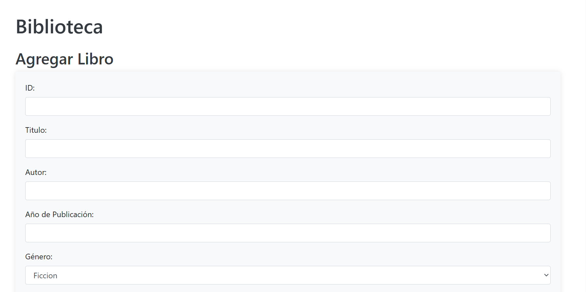
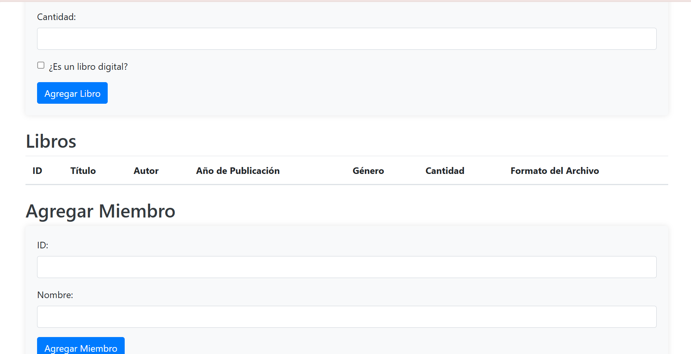
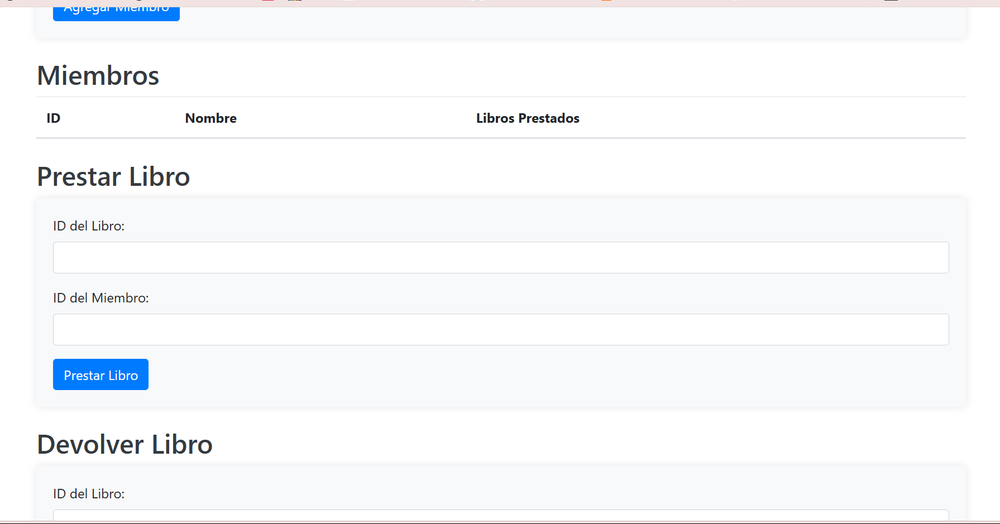

+++ date = '2025-05-12T10:19:41-08:00' 
draft = false 
title = 'Práctica #2 Elementos Básicos del paradigma orientado a objetos' 
+++
# *PARADIGMAS DE LA PROGRAMACIÓN*

En esta práctica, el objetivo es familiarizarse con los elementos fundamentales del paradigma orientado a objetos, los cuales son esenciales para entender cómo funcionan los programas y cómo los lenguajes permiten que los programadores creen soluciones a problemas complejos.

## ¿Qué es el paradigma orientado a objetos?

El paradigma de programación orientada a objetos (POO) es un enfoque de desarrollo de software que se basa en la utilización de **objetos**, los cuales combinan datos y comportamientos relacionados. Este paradigma permite modelar sistemas complejos de forma más intuitiva y estructurada, favoreciendo la reutilización, la escalabilidad y el mantenimiento del código.

## Fundamentos de la Programación Orientada a Objetos

La programación orientada a objetos se basa en **cuatro pilares fundamentales**:

1. **Clases y objetos:**
   - Una clase es una plantilla que define las propiedades (atributos) y comportamientos (métodos) que tendrán los objetos.
   - Un objeto es una instancia de una clase, con valores concretos.

2. **Encapsulamiento:**
   - Consiste en ocultar los detalles internos de un objeto y exponer solo lo necesario a través de interfaces públicas.
   - Protege los datos y mejora la seguridad del código.

3. **Herencia:**
   - Permite que una clase (subclase) herede atributos y métodos de otra (superclase).
   - Promueve la reutilización y extensión del código.

4. **Polimorfismo:**
   - Permite que un mismo método se comporte de manera diferente según el objeto que lo invoque.

Durante esta práctica, analizamos 3 archivos en Python del proyecto `biblioteca2`, observando sus partes y cómo se relacionan con la POO.

##  `biblioteca.py`

**Genre**
Clase utilitaria que define una serie de constantes estáticas para representar los diferentes géneros literarios. Representa una buena práctica de uso de atributos de clase y métodos de clase (`@classmethod`) para mantener una lista centralizada y reutilizable de categorías.

**Book**
Clase base que modela a un libro físico. Aplica los principios de encapsulamiento al almacenar atributos como el título, autor, año de publicación, género y cantidad disponible. También incluye métodos para convertir el objeto a un diccionario (`to_dict`) y reconstruirlo (`from_dict`).

**DigitalBook**
Subclase que hereda de Book, demostrando el principio de herencia. Extiende la funcionalidad de un libro físico al añadir el atributo `file_format`, representando libros digitales. Esta clase también redefine algunos métodos, haciendo uso del polimorfismo.

**Member**
Clase que representa a los miembros de la biblioteca. Incluye atributos como `id`, `name` y una lista de libros prestados. Ilustra claramente el uso de objetos compuestos (libros dentro de una lista) y también permite serialización con métodos `to_dict` y `from_dict`.

**Library**
Clase central del sistema. Encapsula la lógica principal de la aplicación, gestionando tanto libros como miembros. Contiene métodos que reflejan acciones del mundo real como agregar libros o miembros, prestar y devolver libros, o guardar datos. Esta clase representa una abstracción de alto nivel de una biblioteca real.

### Clases definidas:

**Genre:**
Enumera géneros literarios.
Clase con atributos de clase estáticos (simulan un enum).
`@classmethod all_genres()`: permite acceder a todos los géneros.

**Book:**
Representa un libro físico.
Atributos: `id`, `title`, `author`, `publication_year`, `genre`, `quantity`
Métodos:
* `to_dict()` → convierte a diccionario.
* `from_dict()` → crea objeto desde diccionario.
* Gestión de memoria con `__del__` y `memory_management`.

**DigitalBook:**
Subclase de Book para libros digitales.
Hereda de Book, agrega:
* Atributo: `file_format`
* Métodos: sobrescribe `to_dict()` y `from_dict()`

**Member:**
Representa un miembro de la biblioteca.
Atributos: `id`, `name`, `issued_books`
Métodos: `to_dict()`, `from_dict()`

**Library:**
Representa la biblioteca como sistema gestor.
Atributos: listas de `books` y `members`
Métodos:
* CRUD: `add_book`, `add_member`, `find_*`, `display_*`
* Préstamo/devolución: `issue_book`, `return_book`
* Serialización: `save_*`, `load_*`

### Objetos

A lo largo del programa se crean múltiples instancias de estas clases, como:

        book = Book(...)
        digital_book = DigitalBook(...)
        member = Member(...)
        library = Library()

### Encapsulamiento:
def to_dict(self):
    return {
        "id": self.id,
        "title": self.title,
        "author": self.author,
        "publication_year": self.publication_year,
        "genre": self.genre,
        "quantity": self.quantity
    }
Este método permite exponer los datos de un objeto Book de forma controlada, sin permitir el acceso directo o sin restricciones a sus atributos internos.

Además, los métodos como add_book, issue_book, return_book o display_books en la clase Library encapsulan toda la lógica de gestión, protegiendo el funcionamiento interno del sistema.

### Herencia   
DigitalBook hereda de Book.

### Polimorfismo
´´´ def to_dict(self)  # En Book y en DigitalBook
Aunque tienen el mismo nombre, el método de DigitalBook añade "file_format".

´´´ isinstance(book, DigitalBook)
Esto permite un comportamiento diferente al mostrar libros, dependiendo del tipo.

## biblioteca_web.py

El archivo correspondiente a la interfaz web de la biblioteca implementa una API RESTful utilizando el microframework Flask. Aunque no define nuevas clases, su estructura y funcionalidad hacen un uso intensivo de objetos previamente definidos en el módulo biblioteca.

### Clases y Objetos
Desde el inicio del archivo se importan múltiples clases:
from biblioteca import Book, DigitalBook, Member, Library, Genre

A partir de estas clases, se crean objetos que permiten operar con la lógica de la biblioteca:
´´´library = Library()
Este objeto centraliza la gestión de libros, miembros y préstamos. Adicionalmente, en las rutas definidas se crean objetos de Book, DigitalBook y Member a partir de datos recibidos del cliente mediante request json.
Ejemplo:
book = DigitalBook(...)  # o
book = Book(...)
member = Member(...)
Estos objetos encapsulan atributos (como título, autor, ID) y comportamientos asociados (como serializar a diccionario o validar préstamos).

### Encapsulamiento
La lógica de negocio está separada y protegida dentro de métodos definidos en otras clases. Desde la aplicación Flask se interactúa únicamente mediante métodos públicos como:
library.add_book(book)
library.issue_book(book_id, member_id)
library.save_library_to_file("library.json")

### Herencia
El archivo hace uso de herencia al distinguir entre libros físicos (Book) y libros digitales (DigitalBook):
if is_digital:
    book = DigitalBook(...)
else:
    book = Book(...)
DigitalBook es una subclase que hereda de Book y amplía sus atributos y métodos, como incluir el formato de archivo digital (file_format). Esto permite tratar ambos tipos de libros de forma similar en la aplicación, reutilizando comportamiento común.

### Polimorfismo
El polimorfismo se manifiesta principalmente en el uso del método to_dict():
book.to_dict()
Este método puede ser invocado sobre objetos de tipo Book o DigitalBook, pero cada clase puede proporcionar su propia implementación específica. Python se encarga de invocar la versión adecuada según el tipo del objeto en tiempo de ejecución.

## memory_management.py

El módulo memory_management.py define una clase orientada a encapsular la lógica relacionada con el seguimiento del uso de memoria en la aplicación. 

### Clases y Objetos
La clase MemoryManagement se define con el objetivo de representar un componente responsable de monitorear la memoria utilizada en la pila (heap) durante la ejecución del sistema.
class MemoryManagement:
Posteriormente, se crea una instancia u objeto de esta clase:
memory_management = MemoryManagement()
Este objeto es utilizado globalmente por el sistema (por ejemplo, en la interfaz web) para realizar un seguimiento persistente del estado de las asignaciones y liberaciones de memoria.

### Encapsulamiento
El módulo aplica encapsulamiento al mantener los atributos internos de la clase (heap_allocations y heap_deallocations) ocultos a la manipulación directa desde el exterior. El acceso y modificación de estos atributos se realiza exclusivamente a través de métodos públicos:
def increment_heap_allocations(self, size): ...
def increment_heap_deallocations(self, size): ...
def display_memory_usage(self): ...

### Entorno virtual 
Después es profesor nos guio en la creación de un entorno virtual, para ejecutar el programa, los entornos virtuales nos permiten tener una instalación mínima de Python y las librerías que estamos utilizando en el proyecto, para evitar los problemas que se generan con las actualizaciones generadas por el paso del tiempo. 

### Comandos utilizados 

**Instalación de virtualenv**
python -m pip install virtualenv --user
* Instala la herramienta virtualenv localmente para el usuario actual (--user).
* Se usa -m pip para invocar el gestor de paquetes pip como módulo.

**Navegación y preparación del entorno**
cd -git/ gallegos/paradims
* Cambia al directorio donde se guardará el entorno virtual.
* Específico al usuario: aquí usamos nuestra  propia ruta.

**Crear el entorno virtual**
python -m virtualenv env
* Crea un entorno virtual llamado env.
* Se genera una carpeta env/ con todos los archivos necesarios (Python, pip, scripts, etc.).

**Comandos de inspección del entorno**
ls
ls env
ls env/lib
ls env/Scripts
* ls lista los contenidos del directorio actual y los subdirectorios del entorno virtual.
* env/lib contiene las bibliotecas instaladas.
* env/Scripts (en Windows) contiene los scripts para activar/desactivar el entorno.

**Activar el entorno virtual**
source env/Scripts/activate
* Activa el entorno virtual en Windows (Scripts) o Linux/macOS (bin).
* Una vez activado, todos los comandos pip y python usarán este entorno.

**Verificar el entorno activo**
where python
* Muestra la ruta del ejecutable de Python activo.
* Confirma si estás usando el del entorno virtual.

**Página web con entorno virtual**
cd bibliotecav2
pip install flask
* Cambia al directorio del proyecto y luego instala Flask dentro del entorno virtual activo.

**Ejecutar la app Flask**
python src/biblioteca_web.py
* Ejecuta el archivo principal de la app web.
* Nota: siempre se debe tener el entorno virtual activado antes de correr este tipo de archivos.

Con esto creamos una pagina en la que se puede usar el programa desde una liga. 

## Página web

