+++ date = '2025-05-20T10:19:41-08:00' 
draft = false 
title = 'Práctica #3 Elementos e Implementación del Paradigma Funcional' 
+++

# *PARADIGMAS DE LA PROGRAMACIÓN*

# Análisis de aplicacion en Haskell

## Introducción a Haskell y Preparación del Entorno

Antes de entrar con la aplicación, primero se debe definir qué es Haskell.  
Haskell es un **lenguaje de programación puramente funcional**, conocido por su **tipado estático fuerte**, **inferencia de tipos** y **evaluación perezosa**.

## Características principales de Haskell

- **Puramente Funcional**:  
  En Haskell, las funciones son los bloques de construcción principales.  
  Una función pura siempre devuelve la misma salida para la misma entrada y no tiene efectos secundarios.  
  Esto hace que el código sea más predecible y fácil de entender.

- **Tipado Estático**:  
  El tipo de cada expresión se conoce en tiempo de compilación.  
  Esto ayuda a detectar errores desde el inicio del desarrollo, lo que hace que el código sea más robusto.

- **Inferencia de Tipos**:  
  Aunque Haskell tiene tipado estático, no siempre es necesario declarar los tipos explícitamente.  
  El compilador puede inferir los tipos automáticamente en muchos casos.

- **Evaluación Perezosa**:  
  Las expresiones se evalúan solo cuando sus resultados son necesarios.  
  Esto permite trabajar eficientemente e incluso con estructuras de datos infinitas.

> En Haskell se utiliza mucho la **recursión** para resolver problemas.


## Descargar Haskell

Lo primero que se debe hacer es tener Haskell instalado en la computadora.Esto se hizo en el laboratorio con la ayuda del profesor.Para confirmar que la instalación fue correcta, se puede usar el comando:

```bash
ghc --version
```
también se pueden observar los comando que se pueden utilizar escribiendo en consola $stack


## Entorno de desarrollo de Haskell con Stack
Para esto primero me aseguré de estar en la carpeta en la que quería que estuviera, esto lo hice abriendo directamente la carpeta seleccionada con git-bash, se usó el comando $stack new <todo-alondra>, el cual creo una carpeta con el nombre del proyecto y genero archivos base que se configuraran para crear la aplicación.

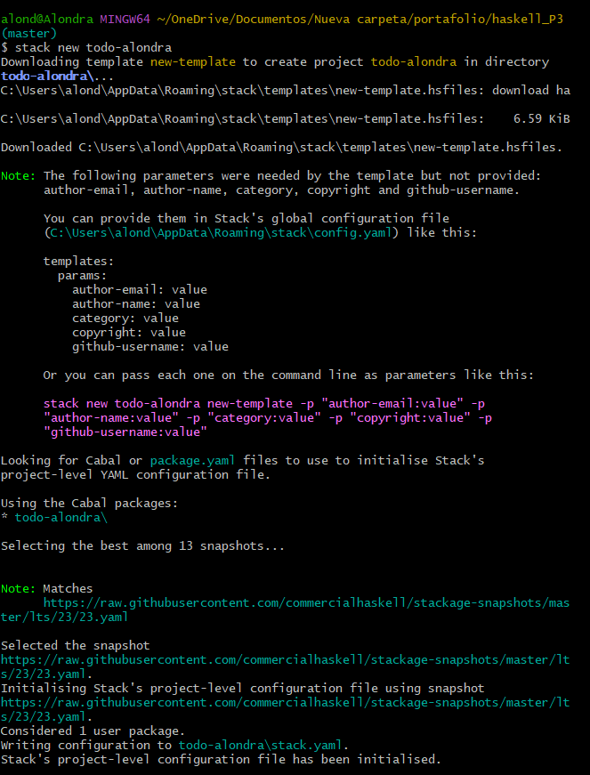


La estructura del proyecto generada incluye varios archivos y directorios importantes:

- **`app/Main.hs`**: Punto de entrada de la aplicación.
- **`src/Lib.hs`**: Contiene la lógica principal de la aplicación de tareas pendientes.
- **`test/Spec.hs`**: Contiene los casos de prueba de la aplicación.
- **`package.yaml`**: Gestiona las dependencias del proyecto.

Para ver los archivos que se crearon, se puede usar el siguiente comando:

```bash
$ ls todo-alondra
```

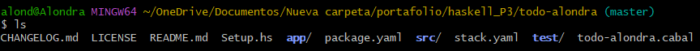

## Usar paquetes en Haskell en el proyecto
Se incluyeron los paquetes dotenv y open-browser, esto se hizo incluyéndolas debajo de la dependencia ya existente - base >= 4.7 && < 5

- **Dotenv :** Permite cargar variables de entorno desde un archivo .env. Esto es útil para guardar configuraciones sensibles o personalizadas (como claves, URLs, o modos de ejecución) sin tener que codificarlas directamente.
- **open-browser:** Permite abrir automáticamente una URL en el navegador por defecto desde tu aplicación Haskell. Es muy práctico para apps web, interfaces locales o documentación.
- 
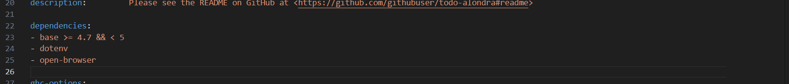

## Probando comandos
Primero probe stack test, el cual compila y ejecuta pruebas automáticas del proyecto lo cual es útil para detectar errores antes de correr el programa completo, la primera vez que lo ejecute me empezó a descargar **MSYS2** que es requerido para compilar ciertos paquetes o correr herramientas auxiliares.

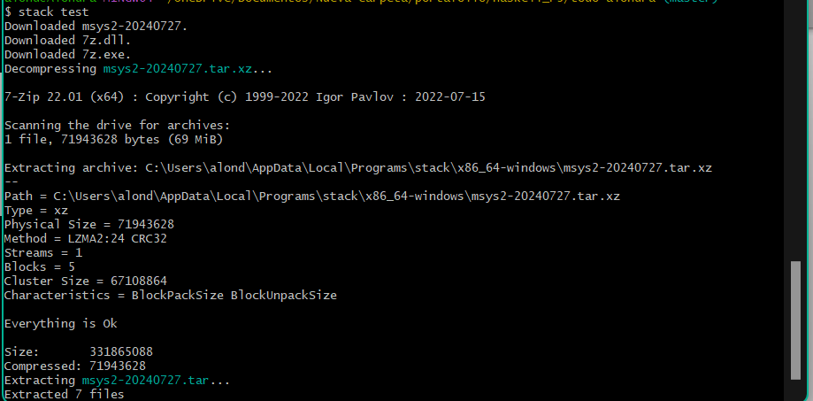

Después de la descarga, ahora sí pude ejecutar el siguiente comando sin problemas:

```bash
$ stack test
```
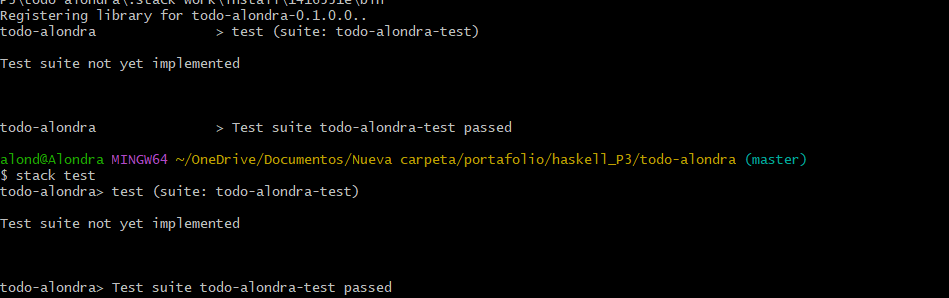

Stack encontró el archivo de pruebas (test/Spec.hs). Lo compiló y ejecutó. Pero el archivo aún no contiene ninguna prueba escrita, así que el test pasa automáticamente (porque no hay nada que falle).

También creo una carpeta llamada stack-work la cual contiene archivos temporales de compilación para que Stack recompilar todo desde cero cada vez, qué módulos ya están compilados y maneje builds reproducibles por proyecto.

Después se utiliza 
```bash
$ stack run 
```
para ver cómo el proyecto Haskell se compila y muestra el resultado en su consola.

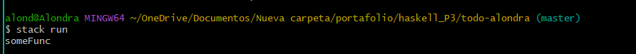

## Aplicación
Se separo app/Main.hs para configurar y ejecutar la aplicación todo-alondra y en src/Lib.hs para proporcionarle lógica de carga útil.


### Main.hs
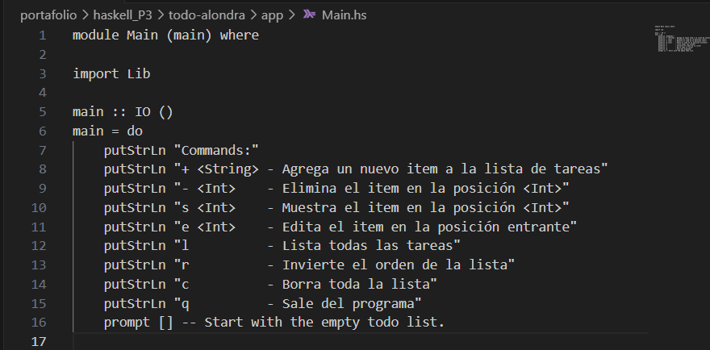

En el main se muestran en consola una guía de uso para el usuario. Cada línea explica un comando que puede usarse en la aplicación, al final se llama a la función prompt, pasándole una lista vacía [ ] que representa la lista de tareas inicial.  Se espera que `prompt` sea una función recursiva que:

* Muestra un `prompt` de entrada al usuario.
* Recibe comandos.
* Actualiza la lista de tareas en memoria.
* Se vuelve a llamar con la nueva lista, hasta que el usuario escriba `q`.

### Lib.hs 
putStrLn se usa solo para mostrar en consola los comandos disponibles de la app.
La función prompt, que está en el archivo Lib.hs, contiene la lógica principal: recibe comandos del usuario, los interpreta y actualiza la lista de tareas. En Main.hs se importa prompt y se ejecuta con prompt [] para iniciar el programa.

#### Descripción de funcionamiento general 
Para gestionar una lista de tareas (todo list). Permite al usuario agregar, eliminar, mostrar, editar, listar, invertir y limpiar tareas mediante comandos escritos. Las tareas se almacenan en una lista y se manipulan con funciones como deleteOne, editIndex y reverseTodos, mientras que la función principal prompt gestiona la interacción con el usuario.

#### Funcionamiento 

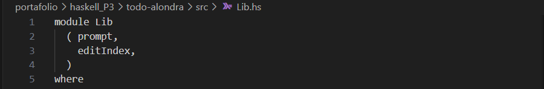
Esto define el **módulo Lib** y exporta solo las funciones prompt y editIndex, para que puedan usarse desde otros archivos (como Main.hs).


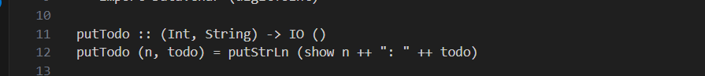
Muestra una tarea con su índice.


Es el **bucle principal interactivo.** Recibe una lista de tareas (todos) y espera comandos del usuario (como + tarea, - 2, l, q, etc.).


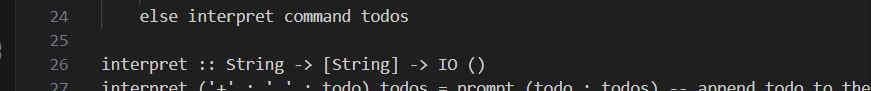
Esta función interpreta cada comando


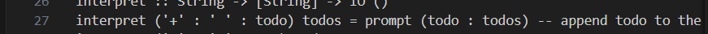
Agrega todo al inicio de la lista y usa : que agrega un elemento al principio (más eficiente que ++).


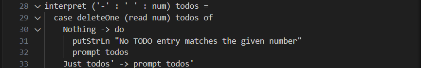
Convierte el número (num) a Int con read, usa deleteOne para eliminar la tarea por índice.


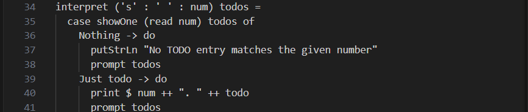
Muestra la tarea específica en esa posición (índice num).


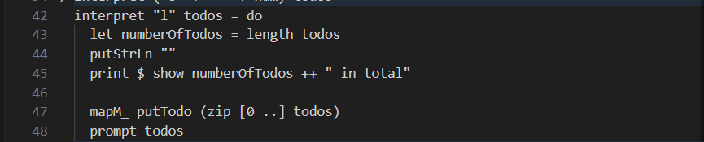
Muestra todas las tareas con su índice, usa zip para emparejar índices con tareas.


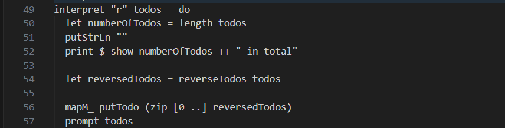
Invierte la lista usando reverseTodos.


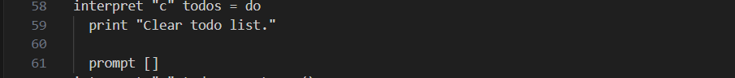
Borra todas las tareas (prompt []).


Termina la ejecución.


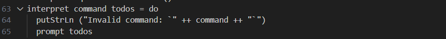
Muestra un mensaje si el comando no es válido.


#### Funciones auxiliares

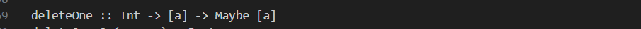
Elimina el elemento en la posición indicada si existe.


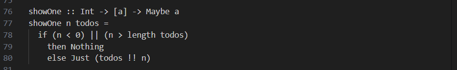
Devuelve el elemento en la posición indicada si existe.


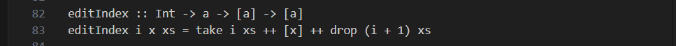
Reemplaza el elemento en el índice i con x.
Usa ++ para unir:
* Lo que está antes (take i xs)
* El nuevo elemento [x]
* Lo que viene después (drop (i+1) xs)


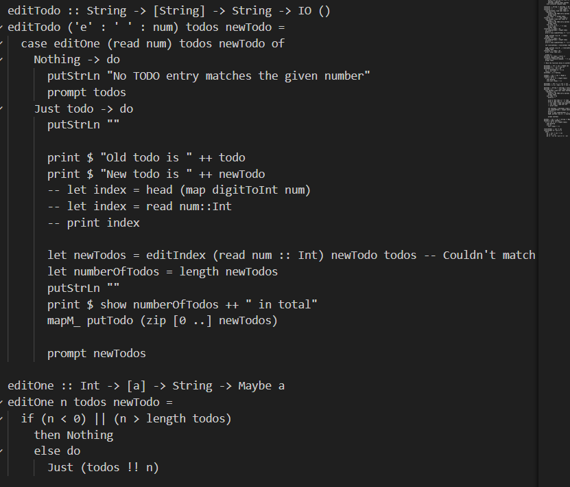
Permiten cambiar una tarea específica por una nueva.


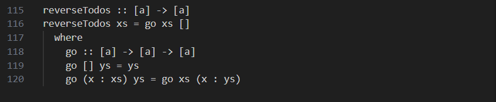
Una versión recursiva de reverse.


## Realizar prueba 

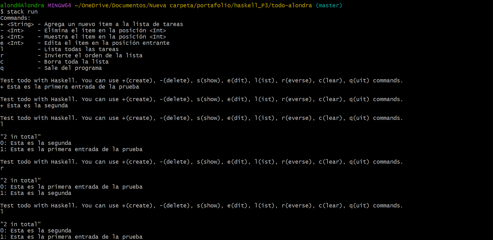


### test/Spec.hs

Para comprobar que la aplicación funciona, se escribió una prueba sencilla para verificar que el $stack test funcionará. 

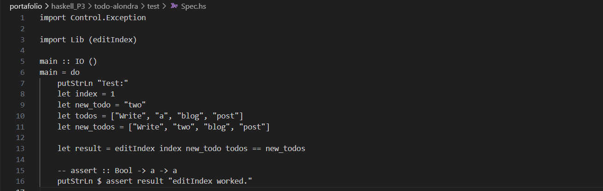
Prueba automática para confirmar que la función de edición de tareas (editIndex) modifica la lista como se espera.


Prueba con $stack test para confirmar que todo funciona bien 
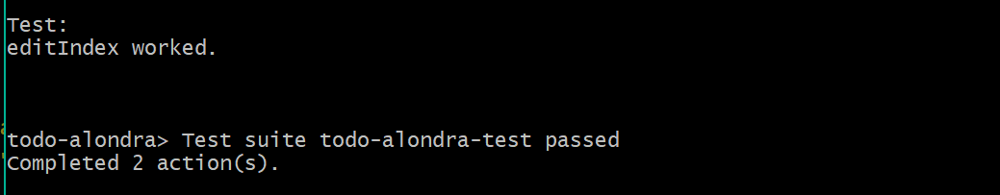