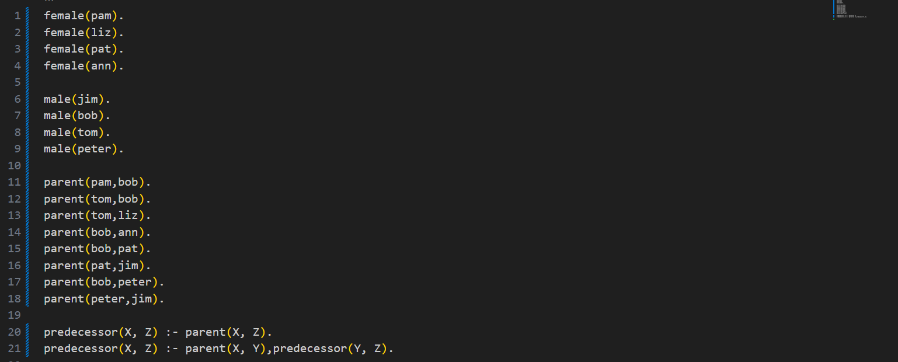

+++ date = '2025-05-28T10:19:41-08:00' 
draft = false 
title = 'Práctica #4 Elementos e Implementación del El paradigma lógico' 
+++

# *PARADIGMAS DE LA PROGRAMACIÓN*


## Primera sesión
Instalación del entorno de desarrollo e introducción a Prolog
Durante la primera sesión, se procedió a la instalación del entorno de desarrollo necesario para trabajar con el lenguaje Prolog. Para ello, se accedió al sitio web oficial de SWI-Prolog y se descargó la versión compatible con el sistema operativo correspondiente.
Una vez instalado el programa, se aprendieron los conceptos básicos para su funcionamiento. Para iniciar el intérprete de SWI-Prolog, se utiliza el comando: 
``` swipl
```

También se explicó cómo crear y trabajar con archivos con extensión .pl, los cuales contienen la base de datos de hechos y reglas del programa. Se hizo énfasis en que cada comando o sentencia debe finalizar con un punto (.) para que el intérprete lo reconozca correctamente.
Finalmente, se aprendió que para salir del intérprete se utiliza el siguiente comando: 
```halt.
```

Esta sesión sirvió como base para familiarizarse con el entorno de desarrollo y la sintaxis elemental de Prolog.


## Segunda sesión 
En esta sesión empezamos a probar bases de datos y a hacer consultas, pero antes de empezar se necesitó una introducción de que es prolog.

## Introducción a Prolog y la programación lógica

Prolog es un lenguaje de programación cuyo nombre proviene de "programación lógica" (PROgramming in LOGic). Se caracteriza por ser un lenguaje declarativo, lo que significa que, en lugar de indicar paso a paso cómo resolver un problema (como ocurre en lenguajes imperativos), simplemente se describe qué se quiere lograr, y el sistema se encarga de encontrar la solución.

Este lenguaje se basa en un paradigma llamado programación lógica, donde los programas están formados por hechos y reglas que representan el conocimiento dentro de un sistema lógico. Un hecho es una afirmación simple que se considera verdadera, por ejemplo: es_hijo(tom, jack). En cambio, una regla es una afirmación condicional que indica cuándo algo es verdadero en función de otras condiciones. Por ejemplo: abuelo(X, Y) :- padre(X, Z), padre(Z, Y). Esta regla expresa que X es abuelo de Y si X es padre de Z y Z es padre de Y.

Además de hechos y reglas, en Prolog se utilizan consultas o preguntas, las cuales permiten inferir información a partir del conocimiento almacenado. El motor lógico de Prolog evalúa estas consultas y determina si son verdaderas según la base de hechos y reglas, o busca posibles respuestas.

A diferencia de otros lenguajes declarativos más puros, como Datalog o ASP (Answer Set Programming), Prolog combina elementos declarativos e imperativos, ya que también permite controlar de forma parcial el orden y la estrategia de resolución de problemas, ofreciendo más flexibilidad.
Comparación con la programación funcional

Mientras que la programación funcional requiere definir los pasos y procedimientos que debe seguir un programa para resolver un problema, en programación lógica simplemente se formula el problema y se proporciona una base de conocimiento. El sistema se encarga de buscar una solución adecuada.
En resumen:
* La programación funcional sigue una lógica secuencial, basada en algoritmos.
* La programación lógica trabaja sobre hechos, reglas y relaciones, usando inferencias.
* En programación funcional se describe cómo resolver el problema.
* En programación lógica se indica qué se quiere resolver, y el sistema busca el cómo.

### Prolog- conceptos básicos 

**Base de Conocimientos:** Esta es una parte fundamental de la Programación Lógica. Veremos en detalle la Base de Conocimientos y cómo ayuda en la programación lógica.

**Hechos, reglas y consultas:** estos son los pilares de la programación lógica. Aprenderemos a fondo sobre hechos y reglas, y también veremos algunos tipos de consultas que se utilizan en la programación lógica.


## Bases de conocimientos 

### Introducción 

#### Base de conocimientos 1
A continuación, se presentan tres bases de conocimiento que contienen informaciónsobre tres personas: Priya, Tiyasha y Jaya. En la primera base de conocimiento se establece que Priya sabe cocinar. 


En esta base, se indica explícitamente que Priya sabe cocinar. 


#### Base de conocimiento 2 
En esta segunda base, se incorporan nuevos hechos o reglas que complementan la información anterior.


 
#### Base de conocimiento 3


En esta tercera base, se observa que al utilizar un punto y coma (;) se obtienen más resultados. Esto indica que el sistema puede explorar múltiples soluciones posibles a partir de las reglas definidas.


### Relaciones
Las **relaciones** son fundamentales y se representan mediante **hechos** y **reglas**. Estas relaciones permiten describir cómo se conectan distintos objetos o individuos dentro de una base de conocimiento.
Por ejemplo, si decimos padre(sudip, piyus)., estamos afirmando una relación de paternidad entre Sudip y Piyus. Este tipo de relaciones también puede extenderse a casos más complejos, como los vínculos familiares, utilizando reglas.


Las relaciones en Prolog permiten modelar conocimiento de forma lógica y estructurada. A través de hechos, reglas y consultas, podemos explorar conexiones entre entidades y construir sistemas inteligentes que respondan a preguntas complejas sobre la información definida.


### Recursión en las relaciones familiares 
La recursión es fundamental en Prolog para definir relaciones que pueden tener múltiples niveles, como la de "predecesor".




En esta base de conocimientos también miramos el el predicado trace el cual se utiliza para depurar el comportamiento de un programa. Permite observar, paso a paso, cómo el motor lógico de Prolog intenta resolver una consulta, mostrando cada una de las decisiones que toma.

¿Para qué sirve?
Cuando escribes una regla o consulta y no obtienes el resultado esperado, trace te ayuda a entender:
* Qué hechos y reglas se están evaluando.
* En qué orden se realizan las comprobaciones.
* Dónde ocurre una falla o una vuelta atrás (backtracking).


### Objetos de datos 
Los objetos de datos en Prolog se clasifican en objetos simples (constantes y variables) y estructuras.
Ejemplos de Objetos de Datos (Términos)
* Átomos: tom, pat, x100, x_45
* Cadenas especiales: :-, =======>, ..., .:., ::=
* Cadenas de caracteres: 'Rubai', 'Hello, World!'
* Números: 100, 1235, 2000.45
* Variables: X, Y, Xval, _X
* Estructuras: día(9, jun, 2017), punto(10, 25)
  


### Operadores 
Prolog soporta operadores de comparación y aritméticos.
* Operadores de Comparación
    * X > Y: X es mayor que Y
    * X < Y: X es menor que Y
    * X >= Y: X es mayor o igual que Y
    * X =< Y: X es menor o igual que Y
    * X =:= Y: Los valores X e Y son iguales
    * X == Y: Los valores X e Y no son iguales
* Operadores Aritméticos
    * +: Suma 
    * -: Resta
    * *: Multiplicación
    * /: División 
    * **: Potencia 
    * //: División de enteros mod: Módulo


 
### Bucles 
Prolog no tiene bucles tradicionales como for o while de otros lenguajes (Java, C, C++). En su lugar, **utiliza recursión** para repetir acciones. A través de predicados recursivos, se puede simular el comportamiento de los bucles y ejecutar un bloque de código varias veces.


### Toma de decisiones 
Las reglas en Prolog actúan como estructuras de toma de decisiones. 


### Conjunción y Disyunción 
En Prolog, se usan operadores lógicos para combinar condiciones:
* **Conjunción (AND)**: Se representa con una coma (,). Ambos predicados deben ser verdaderos para que la expresión sea verdadera.
Ejemplo:
father(X, Y) :- parent(X, Y), male(X).
* **Disyunción (OR)**: Se representa con un punto y coma (;). La expresión es verdadera si al menos uno de los predicados es verdadero.
Ejemplo:
hijo(X, Y) :- padre(X, Y); madre(X, Y).
Estas lógicas son similares al uso de AND y OR en otros lenguajes.


### Listas
Las listas son estructuras de datos fundamentales en Prolog.
Representación de Listas Las listas se representan como [rojo, verde, azul, blanco, oscuro]. Se dividen en una Head (primer elemento) y una Tail (el resto de la lista). Ejemplo: [a, b, c] se puede representar como [a | [b, c]].
* Operaciones Básicas en Listas
    * Comprobación de membresía: Verifica si un elemento pertenece a la lista.
    * Cálculo de longitud: Encuentra el número de elementos en una lista.
    * Concatenación: Une dos listas.
* Operaciones con Listas
    * Eliminar elementos: Remueve un elemento específico de una lista.
    * Añadir elementos: Agrega una lista a otra como un elemento.
    * Insertar elementos: Inserta un elemento en una lista.


* Operaciones de Reposicionamiento de Elementos
    * Permutación: Genera todas las posibles reordenaciones de los elementos de una lista.
    * Elementos inversos: Ordena los elementos de una lista en orden inverso.
    * Elementos desplazados: Desplaza un elemento de una lista rotacionalmente hacia la izquierda.
    * Elementos ordenados: Verifica si una lista está ordenada


### Entradas y Salidas

Prolog permite manejar la entrada y salida, incluyendo la manipulación de archivos y caracteres.


### Predicados Integrados

Prolog ofrece una serie de predicados incorporados para verificar el tipo de una variable o término:

* Predicados Integrados
    - `var(X)`: Verdadero si `X` es una variable no instanciada.
    - `nonvar(X)`: Verdadero si `X` no es una variable o está instanciada.
    - `atom(X)`: Verdadero si `X` es un átomo.
    - `number(X)`: Verdadero si `X` es un número entero o real.
    - `integer(X)`: Verdadero si `X` es un entero.
    - `float(X)`: Verdadero si `X` es un número real.
    - `atomic(X)`: Verdadero si `X` es un número o un átomo.
    - `compound(X)`: Verdadero si `X` es un término compuesto.
    - `ground(X)`: Verdadero si `X` no contiene ninguna variable no instanciada.


### Predicados Matemáticos

Prolog incluye predicados para operaciones matemáticas:

* Predicados Matemáticos
    - `random(L, H, X)`: Obtiene un valor aleatorio entre `L` y `H`.
    - `between(L, H, X)`: Obtiene un valor entre `L` y `H`.
    - `succ(X, Y)`: `X` es el sucesor de `Y` (`X = Y + 1`).
    - `abs(X)`: Valor absoluto de `X`.
    - `max(X, Y)`: Máximo entre `X` e `Y`.
    - `min(X, Y)`: Mínimo entre `X` e `Y`.
    - `round(X)`: Redondea `X` al entero más cercano.
    - `truncate(X)`: Convierte `X` a entero eliminando decimales.
    - `floor(X)`: Redondea `X` hacia abajo.
    - `ceiling(X)`: Redondea `X` hacia arriba.
    - `sqrt(X)`: Raíz cuadrada de `X`.


### Estructuras de Datos y Recursión

En Prolog, las estructuras de datos se representan mediante términos compuestos (como listas o árboles). La recursión es fundamental, ya que reemplaza a los bucles tradicionales. Se definen reglas recursivas con cláusulas base para detener la recursión.


### Estudio de Caso: Árbol

Los árboles son estructuras jerárquicas representadas en Prolog usando términos compuestos y recursión. Un nodo típico se define como:

### Programas básicos
Los "programas básicos" en Prolog se refieren a la implementación de funcionalidades comunes y problemas algorítmicos simples utilizando la lógica declarativa y la recursión.

#### Mínimo y máximo


#### Segmentos de recta Torre de Hanoi
Un problema clásico de recursión que consiste en mover una pila de discos de un poste de origen a un poste de destino, utilizando un poste auxiliar, siguiendo tres reglas: 

* Solo se puede mover un disco a la vez. 
* Un disco más grande no puede colocarse encima de uno más pequeño. 
* Cada disco debe estar en uno de los tres postes
  


#### Lista enlazados
Aunque Prolog tiene soporte nativo para listas, a veces es útil modelar listas enlazadas explícitamente para entender cómo se construyen y manipulan. Una lista enlazada consiste en nodos, donde cada nodo contiene un valor y una referencia (o "puntero" lógico) al siguiente nodo.


#### El mono y el plátano
Este es un problema clásico en inteligencia artificial que ilustra la planificación y la búsqueda en un espacio de estados. El objetivo es que un mono, que está en una habitación con una caja y unos plátanos en el techo, alcance los plátanos. Las acciones del mono cambian el estado del mundo.

**Modelo de Estado** : Podemos representar el estado del mundo con un término que contenga la posición del mono, la posición de la caja, la posición de los plátanos y si el mono tiene los plátanos.

estado(PosMono, PosCaja, PosPlatanos, Tiene)
* PosMono: en(lugar) o en(caja)
* PosCaja: en(lugar)
* PosPlatanos: en(lugar) o en(techo)
* Tiene: nada o platanos


